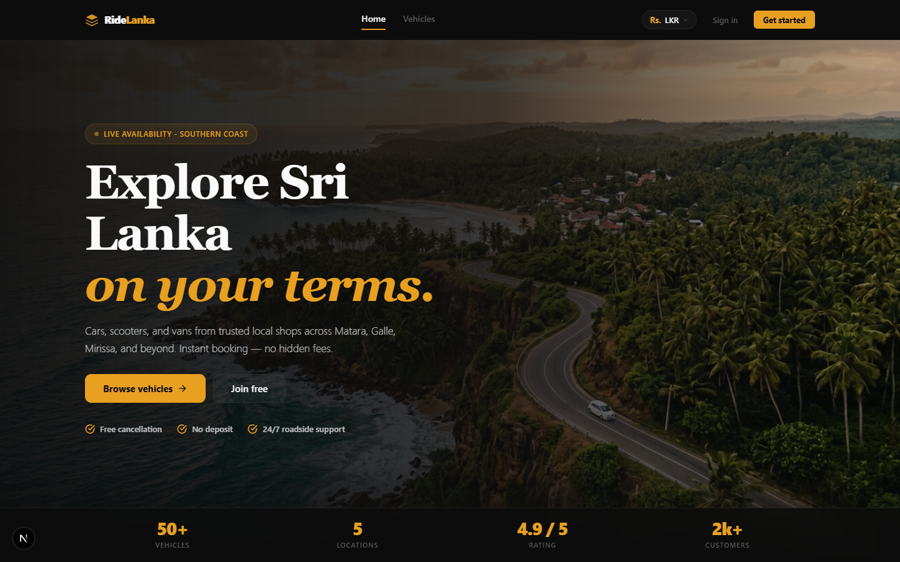
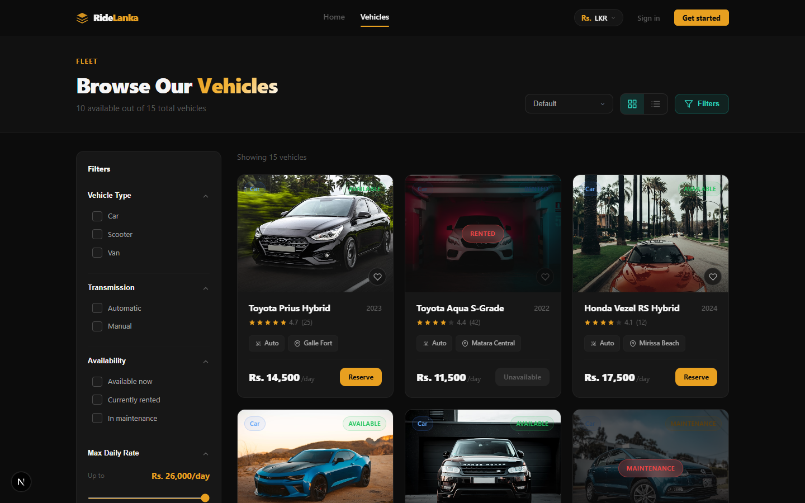
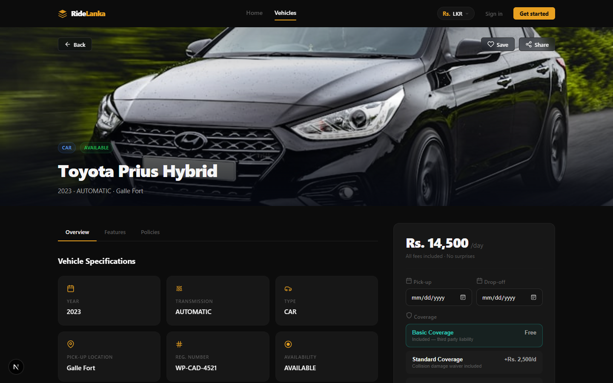
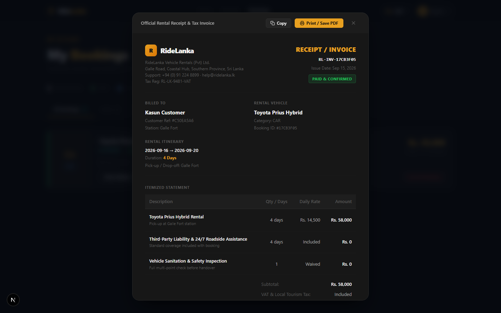
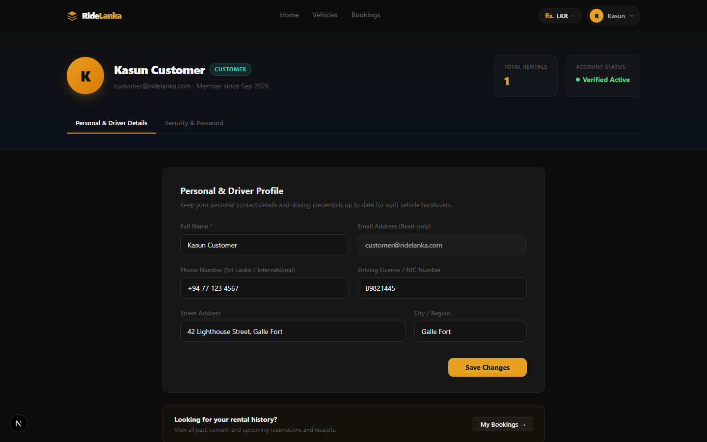
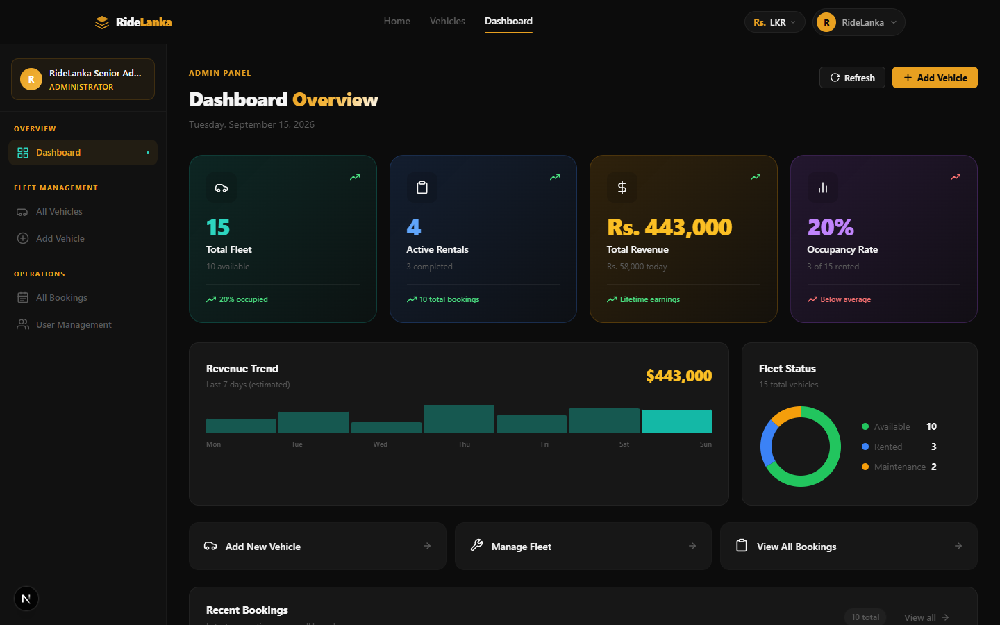
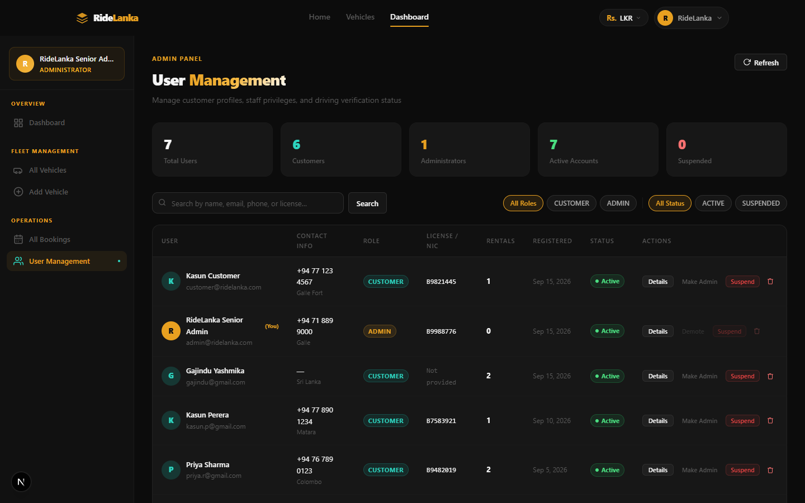
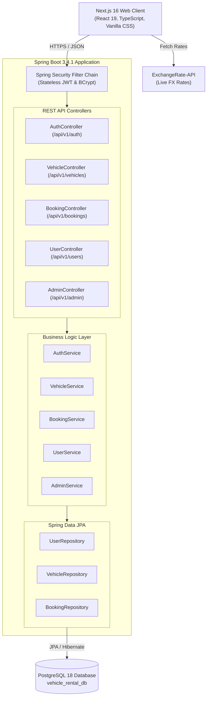

# 🚗 RideLanka - Luxury Vehicle Rental & Mobility Platform

[](https://nextjs.org/)
[](https://react.dev/)
[](https://www.typescriptlang.org/)
[](https://spring.io/projects/spring-boot)
[](https://www.oracle.com/java/)
[](https://www.postgresql.org/)
[](LICENSE)

> An enterprise-grade, full-stack vehicle rental and island-mobility platform designed specifically for Sri Lanka's tourism and transport corridors (Galle Fort, Mirissa Beach, Weligama Surf Point, Matara Central, Tangalle Bay, and Colombo). 

---

## 🌐 Live Hosted Application

The application is deployed with public HTTPS access:

| Service | Public Access URL | Status |
| :--- | :--- | :--- |
| **Primary Live Demo** | **[https://5a4420e1e4f55d.lhr.life](https://5a4420e1e4f55d.lhr.life)** | 🟢 Online (Direct HTTPS) |
| **Mirror / Tunnel** | **[https://ridelanka.loca.lt](https://ridelanka.loca.lt)** | 🟢 Online (Localtunnel) |
| **API Documentation** | `http://localhost:8080/swagger-ui.html` | 🟢 OpenAPI / Swagger 3 |

> 💡 *Note for Localtunnel mirror:* If prompted for a tunnel password, enter the server gateway IP: `112.134.236.169`.

### 🔑 Demo Credentials

| Role | Email Address | Password | Permissions |
| :--- | :--- | :--- | :--- |
| **System Administrator** | `admin@ridelanka.com` | `adminPassword123!` | Full control: Fleet CRUD, Bookings, User Management, Analytics |
| **Registered Customer** | `customer@ridelanka.com` | `adminPassword123!` | Vehicle booking, Profile management, Printable Tax Receipts |
| **Simulated Customer** | `sarah.m@gmail.com` | `adminPassword123!` | Historical rental history, Active bookings, Profile |

---

## 📸 Visual Tour & Application Screenshots

### 1. Home Page & Island Exploration Hero
Luxury editorial hero with booking search widget, curated Sri Lankan destinations (Galle, Mirissa, Weligama), and live fleet metrics.


---

### 2. Dynamic Fleet Catalog & Real-Time Multi-Currency Switcher
Comprehensive inventory filtering by category (Cars, Scooters, Luxury Vans), branch pickup location, transmission, and real-time live currency conversion (LKR, USD, EUR, GBP, AUD, CAD, JPY).


---

### 3. Vehicle Detail & Instant Cost Quotation
Comprehensive vehicle specifications, safety features, branch pickup terms, and dynamic price quote calculator with instant booking confirmation.


---

### 4. Official Printable Tax Invoice & Receipt Modal
Sri Lanka Inland Revenue Department (IRD) compliant rental invoice displaying base rental charges, 2.5% Social Security Contribution Levy (SSCL), 18% Value Added Tax (VAT), refundable security deposit, and a single-click **Print / Save as PDF** function.


---

### 5. Customer Self-Service Profile Management
Customer control panel for updating personal identity information, verified driving license/NIC number, emergency contact phone, island delivery address, and secure password changes.


---

### 6. Admin Fleet Operations & Analytics Dashboard
Executive management cockpit highlighting total revenue, active rentals, total fleet inventory, vehicle status distribution, and quick booking approvals.


---

### 7. Enterprise User & Customer Management Console
Centralized administrator directory providing live user counts, role management (promote/demote between `CUSTOMER` and `ADMIN`), instant account suspension/activation toggles, search, and user details modal.


---

## ⚡ Core Features & Capabilities

### 💱 Real-Time Multi-Currency Engine
- Base vehicle rates are calculated in **Sri Lankan Rupees (LKR)**.
- Integrated **ExchangeRate-API** client seamlessly converts prices across:
  - 🇱🇰 **LKR** (Sri Lankan Rupee)
  - 🇺🇸 **USD** (US Dollar)
  - 🇪🇺 **EUR** (Euro)
  - 🇬🇧 **GBP** (British Pound)
  - 🇦🇺 **AUD** (Australian Dollar)
  - 🇨🇦 **CAD** (Canadian Dollar)
  - 🇯🇵 **JPY** (Japanese Yen)
- Automatic fallback to pegged central exchange rates in case of network disruptions.

### 🧾 Official Printable Tax Invoices & Receipts
- Accessible for all confirmed and completed bookings under `/bookings`.
- Displays formal invoice number, issue date, customer details, driving license, and vehicle registration.
- Itemized financial breakdown:
  - Base Daily Rate × Rental Days
  - Refundable Security Deposit
  - SSCL (Social Security Contribution Levy - 2.5%)
  - VAT (Value Added Tax - 18.0%)
  - Total Paid Amount
- Custom `@media print` CSS stylesheet strips headers, footers, and modal backgrounds to generate a crisp A4 paper invoice when printing or saving as PDF.

### 👤 Customer Profile Management (`/profile`)
- View and update full legal name, phone number, city, and street address.
- Maintain verified driving license number for rental pickup verification.
- Secure password change module with current password verification and BCrypt encryption.
- Lifetime rental stats and rental history counter.

### 🛡️ Admin User Management Console (`/dashboard/users`)
- Real-time KPI summary (Total Users, Customers, Administrators, Suspended Accounts).
- Live search across users by name or email.
- One-click role elevation/demotion (`CUSTOMER` ↔ `ADMIN`).
- Instant account status toggle (`Active` ↔ `Suspended`) to ban fraudulent accounts.
- View user details modal with rental history count and registration date.

### 🚘 Fleet & Inventory Management (`/dashboard/vehicles`)
- Vehicle catalog management (Cars, Scooters, Vans).
- Operational status lifecycle: `AVAILABLE` ➔ `RENTED` ➔ `MAINTENANCE`.
- Branch allocation across Galle, Mirissa, Weligama, Matara, Tangalle, and Colombo.

---

## 🏗️ Architecture & Technology Stack



### Technology Matrix

| Layer | Technology | Key Capabilities |
| :--- | :--- | :--- |
| **Frontend Framework** | **Next.js 16.3.5 (App Router)** | Server & Client Components, Turbopack, Fast Refresh |
| **UI Library** | **React 19.2.8** | Modern hooks, transitions, zero third-party bloated UI libraries |
| **Language** | **TypeScript 5.0** | End-to-end type safety, strict interface contracts |
| **Styling** | **Vanilla CSS Design Tokens** | Custom HSL palette, dark theme, micro-animations, print CSS |
| **Backend Framework**| **Spring Boot 3.4.1** | Enterprise Java microframework, Dependency Injection |
| **Security** | **Spring Security 6 + JWT** | Stateless token auth (`jjwt 0.12.6`), role-based access control |
| **Persistence** | **Spring Data JPA / Hibernate 6** | Object-Relational Mapping, transactional queries |
| **Database** | **PostgreSQL 18** | Relational integrity, UUID primary keys, full indexing |
| **API Documentation** | **Springdoc OpenAPI 2.7.0** | Swagger UI documentation, OpenAPI 3.0 schema |

---

## 📡 REST API Reference

All backend endpoints are prefixed with `/api/v1`.

### Authentication Endpoints (`/api/v1/auth`)
| Method | Endpoint | Access | Description |
| :--- | :--- | :--- | :--- |
| `POST` | `/api/v1/auth/register` | Public | Register new customer or administrator account |
| `POST` | `/api/v1/auth/login` | Public | Authenticate user and receive signed JWT token |

### Vehicle Endpoints (`/api/v1/vehicles`)
| Method | Endpoint | Access | Description |
| :--- | :--- | :--- | :--- |
| `GET` | `/api/v1/vehicles` | Public | List all vehicles with optional filters (category, branch, status) |
| `GET` | `/api/v1/vehicles/{id}` | Public | Get detailed vehicle specifications by UUID |
| `POST` | `/api/v1/vehicles` | `ADMIN` | Register a new vehicle in fleet inventory |
| `PUT` | `/api/v1/vehicles/{id}` | `ADMIN` | Update vehicle information and daily rate |
| `DELETE` | `/api/v1/vehicles/{id}` | `ADMIN` | Remove a vehicle from fleet inventory |

### Booking Endpoints (`/api/v1/bookings`)
| Method | Endpoint | Access | Description |
| :--- | :--- | :--- | :--- |
| `GET` | `/api/v1/bookings` | Authenticated | List bookings (Customer sees own; Admin sees all) |
| `POST` | `/api/v1/bookings` | Authenticated | Create a new reservation with date conflict validation |
| `PATCH` | `/api/v1/bookings/{id}/status`| Authenticated | Update booking status (`CONFIRMED`, `COMPLETED`, `CANCELLED`)|

### User Profile Endpoints (`/api/v1/users`)
| Method | Endpoint | Access | Description |
| :--- | :--- | :--- | :--- |
| `GET` | `/api/v1/users/me` | Authenticated | Retrieve authenticated user profile and stats |
| `PUT` | `/api/v1/users/me` | Authenticated | Update user name, phone, license, and address |
| `PUT` | `/api/v1/users/me/password` | Authenticated | Change account password securely |

### Admin Management Endpoints (`/api/v1/admin`)
| Method | Endpoint | Access | Description |
| :--- | :--- | :--- | :--- |
| `GET` | `/api/v1/admin/users` | `ADMIN` | List all system users with rental counts |
| `PATCH`| `/api/v1/admin/users/{id}/role` | `ADMIN` | Update user role (`CUSTOMER` or `ADMIN`) |
| `PATCH`| `/api/v1/admin/users/{id}/status`| `ADMIN` | Toggle user active/suspended state |

---

## 🛠️ Local Development & Setup

### Prerequisites
- **Java Development Kit (JDK)**: Version 17 or higher
- **Node.js**: Version 18.0.0 or higher
- **PostgreSQL**: Version 14 or higher
- **Git**: Installed and configured

---

### Step 1: Clone the Repository
```bash
git clone https://github.com/gajinduyashmika/RideLanka-Vehicle-Rental-Platform.git
cd RideLanka-Vehicle-Rental-Platform
git checkout develop
```

---

### Step 2: Configure PostgreSQL Database
Create a database named `vehicle_rental_db` in PostgreSQL:
```sql
CREATE DATABASE vehicle_rental_db;
```

Update your database credentials in `backend/src/main/resources/application.properties`:
```properties
spring.datasource.url=jdbc:postgresql://localhost:5432/vehicle_rental_db
spring.datasource.username=postgres
spring.datasource.password=your_postgres_password
spring.jpa.hibernate.ddl-auto=update
```

*(Optional)* Pre-populate simulated fleet data and customers:
```bash
psql -U postgres -d vehicle_rental_db -f backend/src/main/resources/seed.sql
```

---

### Step 3: Run the Spring Boot Backend
Navigate to the `backend` directory and start the service:

**Windows (PowerShell):**
```powershell
cd backend
.\mvnw.cmd spring-boot:run
```

**macOS / Linux:**
```bash
cd backend
./mvnw spring-boot:run
```

The backend server starts at: `http://localhost:8080`.  
Swagger documentation is available at: `http://localhost:8080/swagger-ui.html`.

---

### Step 4: Run the Next.js Frontend
Open a new terminal window, navigate to `frontend`, and install dependencies:
```bash
cd frontend
npm install
npm run dev
```

The frontend web app starts at: `http://localhost:3000`.

---

## 📁 Repository Directory Structure

```text
RideLanka-Vehicle-Rental-Platform/
├── backend/                               # Spring Boot 3.4.1 Java Application
│   ├── src/main/java/com/vehiclerental/
│   │   ├── config/                        # SecurityConfig, JwtAuthFilter, CorsConfig
│   │   ├── controller/                    # Auth, Vehicle, Booking, User, Admin Controllers
│   │   ├── dto/                           # Request & Response Data Transfer Objects
│   │   ├── entity/                        # JPA Entities: User, Vehicle, Booking
│   │   ├── enums/                         # Role, VehicleCategory, BookingStatus, VehicleStatus
│   │   ├── repository/                    # Spring Data JPA Repositories
│   │   └── service/                       # Business Logic Services
│   ├── src/main/resources/
│   │   ├── application.properties         # Server, Database, and JWT configuration
│   │   └── seed.sql                       # Database seed script with 15+ vehicles & users
│   └── pom.xml                            # Maven dependencies specification
│
├── frontend/                              # Next.js 16.3.5 React Application
│   ├── src/
│   │   ├── app/
│   │   │   ├── bookings/                  # Customer bookings & Printable Receipt modal
│   │   │   ├── dashboard/                 # Admin operations cockpit
│   │   │   │   ├── users/                 # Enterprise User Management Console
│   │   │   │   └── vehicles/              # Fleet inventory management
│   │   │   ├── login/ & register/         # Authentication views
│   │   │   ├── profile/                   # Customer Profile Management view
│   │   │   ├── vehicles/                  # Fleet catalog & vehicle detail pages
│   │   │   ├── layout.tsx                 # Root layout with Navbar, Currency Switcher & Footer
│   │   │   └── page.tsx                   # Luxury Home page & Island destinations
│   │   ├── components/                    # Reusable UI widgets (Navbar, Footer, Modals)
│   │   └── context/                       # AuthContext & CurrencyContext providers
│   ├── public/                            # Static assets and destination hero imagery
│   └── package.json                       # Next.js, React, and TypeScript dependencies
│
├── screenshots/                           # High-resolution application preview images
│   ├── 01_home_hero.png
│   ├── 02_fleet_catalog.png
│   ├── 03_vehicle_details.png
│   ├── 04_tax_invoice_receipt.png
│   ├── 05_user_profile.png
│   ├── 06_admin_dashboard.png
│   └── 07_admin_user_management.png
│
└── README.md                              # Comprehensive project documentation
```

---

## 📄 License

This project is licensed under the **MIT License** — see the [LICENSE](LICENSE) file for details.

---

<p align="center">
  <b>Developed by Gajindu Yashmika</b> • Sri Lanka 🇱🇰<br/>
  <i>RideLanka — Seamless Mobility Across the Wonder of Asia</i>
</p>
